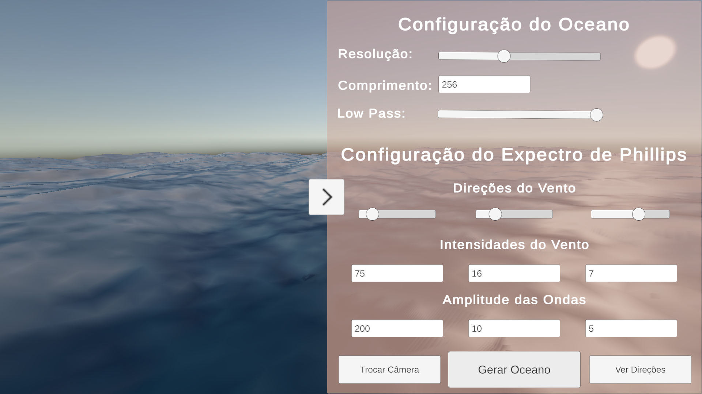

# Simulação de Oceano com FFT
### Theo Luigi Negreiros Gonçalves

## 1. Apresentação
Este projeto explora a simulação de superfícies oceânicas em tempo real utilizando a plataforma de desenvolvimento Unity. A abordagem adotada se distancia da simulação física complexa de fluidos, que possui um alto custo computacional. Em vez disso, o método implementado baseia-se na técnica descrita pelo pesquisador **Jerry Tessendorf** em [***Simulating Ocean Water***](#6-referências), que utiliza uma abordagem estatística e de processamento de sinais para gerar um resultado visualmente convincente e performático.

O princípio fundamental é que uma superfície complexa como a do oceano pode ser representada pela soma de um grande número de ondas senoidais simples. As características dessas ondas (amplitude, direção, comprimento) são determinadas por um modelo estatístico conhecido como **Espectro de Phillips**, que simula o efeito do vento sobre a água. Para realizar a soma de milhares de ondas de forma eficiente a cada quadro, o projeto emprega o algoritmo da **Transformada Rápida de Fourier (FFT)**, permitindo a animação fluida e em tempo real.

O resultado é uma simulação interativa onde o usuário pode controlar parâmetros como a força e direção dos ventos para esculpir a aparência do oceano, de um mar calmo a uma tempestade agitada, com efeitos visuais realistas como reflexos do céu e o Efeito Fresnel.

## 2. O Programa
### Como Executar o Programa
#### Windows
Baixe o [repositório](https://github.com/theoluiging/wave-simulation-fft "theoluiging/wave-simulation-fft") inteiro ou abra este [link](https://downgit.github.io/#/home?url=https://github.com/theoluiging/wave-simulation-fft/tree/main/BuildWindows "Build para Windows") e baixe apenas a pasta contendo a build.

Após isso, abra a pasta `BuildWindows` e execute `WaveSimulation.exe`.

### Guia de Utilização
O projeto foi desenvolvido na Unity e pode ser operado por meio de um menu no canto direito da tela. Após iniciar a simulação, o usuário pode ajustar os seguintes parâmetros em tempo real para modificar a aparência do oceano:

#### **Configurações do Oceano**

- **Resolução:** Um slider que controla a quantidade de vértices da grade que será gerada. Cada passo do slider representa uma potência de 2, por padrão a resolução está configurada em $2^7$ (um quadrado com 128 vértices em cada aresta, ou seja $128^2$ vértices), não é recomendado aumentá-la pois pode gerar travamentos.

- **Comprimento:** Define o tamanho do patch de oceano no mundo. por padrão está configurado para 256.

- **Low Pass Filter (Filtro de Baixa Passagem):** Um slider de 0 a 1 que controla a suavidade da superfície.

    - **1.0:** Nenhum filtro, todos os detalhes são visíveis.

    - **Valores menores (ex: 0.9):** Removem as frequências mais altas e "ruidosas", suavizando a superfície.

#### **Configurações do Expectro de Phillips**

- **Wave Systems (Sistemas de Ondas):** O principal controle da simulação. É uma lista de 3 elementos onde cada um deles representa um sistema de ondas independente, com seus próprios parâmetros:

    - **Amplitude:** Um multiplicador para a "energia" geral desse sistema. Valores altos geram ondas mais altas e dramáticas.

    - **Vento:** Um vetor 2D (X, Y) que define a velocidade e a direção do vento para aquele sistema. Ventos fortes (valores altos de X e Y) geram ondas mais longas e poderosas, que formam a base do oceano. Múltiplos sistemas com ventos em direções diferentes criam uma superfície caótica e natural. Esse parâmetro é configurado de duas maneiras:
        - **Direção:** Um slider onde se pode controlar a direção do vento do sistema
        - **Intensidade:** Controla a força do vento (tamanho do vetor) para aquele sistema.
#### Botões
- **Gerar Oceano:** O principal botão para aplicar as mudanças de parâmetros e gerar uma nova simulação.
- **Trocar Câmera:** Altera entre duas opções de câmera, uma na linha do horizonte mostrando uma visão realista do oceano, e outra numa posição acima, enquadrando toda a malha da simulação.
- **Ver Direções:** Este botão permite ao usuário visualizar os vetores do vento de cada sistema de ondas enquanto faz alterações.

<i>(Imagem 2.1) Interface do programa com seus parâmetros.</i>
 

## 3. Fundamentos Teóricos
A simulação é construída sobre três conceitos teóricos fundamentais que, combinados, permitem gerar uma superfície oceânica complexa de forma eficiente.

1. **Decomposição em Senos e a Representação das Ondas:** 
A base do modelo é a ideia de que qualquer superfície complexa pode ser decomposta em uma soma de muitas funções senoidais simples. Cada onda senoidal individual, ou onda plana, pode ser descrita matematicamente. A altura $h$ em uma posição horizontal $x_⊥$ no tempo $t$ é dada por:

    $h(x_⊥,t)=h_0 \exp\{ik⋅x_⊥−iωt\}$ 
<i>(Equação 1) Página 6 de <a   href="#6-referências">Simulating Ocean Water</a></i>
 

    Onde:
     - $h_0$ é a amplitude complexa inicial da onda.
     - $k$ é o vetor de onda 2D, que aponta na direção de propagação da onda e cuja magnitude $k=∣k∣$ está relacionada ao seu comprimento de onda $λ$ por $k=2π/λ$.
     - $ω$ é a frequência temporal, que dita a velocidade de oscilação da onda.

<i>(Imagem 3.1) Exemplo de uma onda complexa.</i>
   

<i>(Imagem 3.2) Decomposição da onda acima em três ondas simples.</i>
   

2. **O Espectro Estatístico de Phillips:** 
Para criar um oceano realista, não podemos escolher as amplitudes $h_0$ aleatoriamente. Precisamos de um modelo que nos diga quanta energia cada tipo de onda (cada $k$) deve ter. O Espectro de Phillips é um modelo para um oceano sob a influência de vento e é dado pela equação:

    $P_h(k)=A \frac{\exp(−1/(kL)^2)}{k^4} ∣\hat{k} ⋅ \hat{w}∣^2$ 
<i>(Equação 2) Página 9 de <a href="#6-referências">Simulating Ocean Water</a>.</i>
  

    Onde:
     - $A$ é uma constante numérica que ajusta a amplitude global das ondas.
     - $L=V^2/g$ é a escala da maior onda que pode ser sustentada por um vento de velocidade $V$ (com $g$ sendo a gravidade). Este termo suprime ondas gigantescas e irrealistas.
     - O termo $1/k^4$ dita que a energia diminui rapidamente para ondas mais curtas (k grande).
     - $∣\hat{k} ⋅ \hat{w}∣^2$ é o fator direcional. Ele garante que as ondas se alinhem preferencialmente com a direção do vento $\hat{w}$
  
    Para evitar artefatos em ondas muito pequenas, o artigo também sugere um fator de supressão adicional, $\exp(-k^2l^2)$, onde $l$ é um comprimento de corte muito pequeno.

<i>(Imagem 3.3) Gráfico da equação do Espectro de Phillips para A=0.001 e L=11.  O eixo x representa k, a magnitude da frequência da onda, e o eixo y representa P(k), a energia do sistema.</i>
   

1. **Animação com a Relação de Dispersão e a Eficiência da FFT:** 
Para que as ondas se movam de forma realista, suas velocidades devem depender de seus comprimentos de onda. Este fenômeno é conhecido como dispersão. Em águas profundas, a relação de dispersão é:

    $w^2(k)=gk$ 
<i>(Equação 3) Página 8 de <a href="#6-referências">Simulating Ocean Water</a>.</i>
  

    Isso significa que a frequência temporal $ω$ é proporcional à raiz quadrada da frequência espacial $k$. Na prática, ondas mais longas ($k$ pequeno) viajam mais rápido que ondas mais curtas ($k$ grande), o que é um comportamento chave para o realismo visual do oceano.
  
    O desafio computacional é somar milhares dessas ondas animadas a cada quadro. Uma soma direta teria uma complexidade de $O(N^2)$, tornando a simulação em tempo real impraticável para um grande número de ondas. A Transformada Rápida de Fourier (FFT) é um algoritmo que resolve este problema, reduzindo a complexidade para $O(NlogN)$.

    A FFT e sua inversa (IFFT) nos permitem converter dados de forma eficiente entre dois domínios:

    - **Domínio da Frequência:** Onde o oceano é representado pelo seu espectro $(h_0(k))$. Aqui, aplicamos o modelo de Phillips e a animação de dispersão de forma muito barata (simples multiplicações).

    - **Domínio Espacial:** Onde o oceano é uma grade de alturas de vértices. A IFFT nos leva do domínio da frequência para este domínio, efetivamente realizando a soma massiva de senos e nos dando a superfície final para renderizar.
  
Esta técnica tem sido usada há décadas para representar superfícies oceânicas fidedignas por grandes produções do meio audiovisual como *Titanic* e *Waterworld*, exemplificado por Tessendorf em seu artigo de 2004. No entanto, mesmo fazendo mais de 20 anos desde a publicação do artigo, os métodos demonstrados nele ainda estão presentes em produções atuais, principalmente no meio de desenvolvimento de jogos, como por exemplo *Sea of Thieves* e *Assassin's Creed IV: Black Flag*.

<i>(Imagem 3.4) Exemplo da simulação de oceano em Sea of Thieves, um jogo de 2018.</i>
  

## 4. Implementação
O projeto foi desenvolvido em C# na Unity, utilizando o Universal Render Pipeline (URP). A arquitetura é dividida em três componentes principais:
- **Geração de Malha Procedural (`InitializeMesh`):** Um dos primeiros desafios técnicos foi a renderização correta da superfície da malha. Uma triangulação uniforme, onde a diagonal de cada "quad" da grade aponta na mesma direção, resultava em artefatos visuais de longas linhas paralelas que quebravam o realismo. Para solucionar este problema, a malha do oceano é gerada proceduralmente com uma triangulação alternada. Utilizando um padrão de xadrez (`(x+z)%2==0`), a direção da diagonal é invertida para cada quad adjacente. Este método quebra a continuidade das arestas diagonais ao longo da malha, eliminando as linhas e resultando em uma superfície geometricamente mais natural.

<i>(Imagem 4.1) Captura de tela do editor da Unity demonstrando a malha gerada.</i>
   

- **Implementação da FFT (`FFT.cs`):** Como a Unity não possui uma biblioteca nativa para a Transformada Rápida de Fourier, foi implementada uma classe estática com uma implementação comum da FFT para esta finalidade.
  - **Algoritmo 1D:** O núcleo da classe é um método que implementa o algoritmo [**FFT Cooley-Tukey radix-2**](https://en.wikipedia.org/wiki/Cooley–Tukey_FFT_algorithm). Este algoritmo recursivo é altamente eficiente, mas exige que o tamanho da entrada de dados seja uma potência de dois (ex: 64, 128, 256), um requisito que foi incorporado aos parâmetros da simulação.
  
  - **FFT 2D a partir da 1D:** Para processar a grade de oceano 2D, a FFT 2D foi construída aplicando-se a FFT 1D a todas as linhas da matriz de dados e, em seguida, aplicando a mesma FFT 1D a todas as colunas do resultado.
  
  - **Números Complexos e Direcionalidade:** Uma estrutura `Complex` simples foi criada para lidar com as partes real e imaginária dos dados. O mesmo método da FFT é utilizado tanto para a transformada direta (FFT) quanto para a inversa (IFFT), controlado por um parâmetro de direção (`+1` ou `-1`) que simplesmente inverte o sinal no expoente do cálculo. A IFFT também inclui um passo de normalização, dividindo cada resultado pelo número total de amostras.
- **Simulação das Ondas (`WaveSimulation.cs`):** Este é o script principal, que controla a simulação.
  - **Múltiplos Sistemas de Ondas:** Para criar uma superfície mais natural e caótica, o script suporta uma lista de `WaveSystem`. O espectro final é a soma dos espectros de Phillips de cada sistema.
  
  - **Geração do Espectro (`GetPhillipsSpectrum`):** A implementação desta função segue fielmente o modelo de Phillips, garantindo uma distribuição de energia fisicamente coerente. Na inicialização, o espectro de Phillips de cada sistema é calculado e somado para formar um único espectro inicial `h0` complexo. A cada quadro, a animação é realizada no domínio da frequência, conforme a equação de evolução temporal, antes da aplicação da IFFT:
  
    $\tilde{h}(k,t) =\tilde{h}_0(k)\exp\{iω(k)t\}+\tilde{h} \overset{_*}{_0}(-k)\exp\{-iω(k)t\}$ 
<i>(Equação 4) Página 9 de <a href="#6-referências">Simulating Ocean Water</a>.</i>
  
  - **Cálculo de Normais:** As normais da superfície, cruciais para a iluminação, são calculadas de forma exata também via FFT. A inclinação $ϵ(x,t)$ é a derivada da altura, que no domínio da frequência se torna uma simples multiplicação por $ik$:
  
    $ϵ(x,t)=∇h(x,t)=∑_k ik\tilde{h}(k,t)\exp(ik ⋅ h)$ 
<i>(Equação 5) Página 9 de <a href="#6-referências">Simulating Ocean Water</a>.</i>
  
  
  - **Filtro de Baixa Passagem (Low Pass):** Para corrigir artefatos de alta frequência, um filtro de baixa passagem opera diretamente no domínio da frequência, zerando componentes que excedem um limite ajustável.
- **Shader Visual (`Agua_Shader`):** O material da água foi criado utilizando o Shader Graph do URP. Ele implementa o **Efeito Fresnel**, que mistura a cor base da água com o reflexo do Skybox da cena, o que é essencial para um visual acreditável.
  

<i>(Imagem 4.1) Captura de tela do setup de nós do Shader Graph, demonstrando a lógica do Efeito Fresnel.</i>
   

## 5. Resultados
A aplicação dos fundamentos teóricos e das soluções de implementação resultou em uma simulação de oceano em tempo real visualmente  dinâmica. O resultado final demonstra a eficácia do método: a sobreposição de múltiplos sistemas de ondas cria uma superfície natural e caótica, onde ondas longas e poderosas coexistem com ondulações menores que adicionam detalhe.

<i>(Imagem 5.1) Resultado final.</i>
   

<i>(Imagem 5.2) Visão da malha completa na segunda câmera.</i>
   

<i>(Imagem 5.3) Comparação entre um mar calmo e um mar com aplitudes de onda grandes.</i>
   

<i>(Imagem 5.4) Mesma comparação anterior em outro ângulo.</i>
   

**Uma possível melhoria no projeto:** Atualmente, todos os cálculos da FFT e da deformação da malha são realizados na CPU, o que não é ideal para uma simulação desse tipo. Migrar estes cálculos, que são inerentemente paralelos, para a GPU utilizando Compute Shaders resultaria em um ganho de performance massivo. Isso permitiria o uso de grades de simulação muito maiores (ex: 1024x1024 ou 2048x2048) em tempo real, aumentando drasticamente o nível de detalhe visual.
    
## 6. Referências
1. [*Simulating Ocean Water* - Jerry Tessendorf](https://people.computing.clemson.edu/~jtessen/reports/papers_files/coursenotes2004.pdf)
2. [*Water Wave Simulation* - Scott Lembcke](https://www.slembcke.net/blog/WaterWaves/)
3. [*I Tried Simulating The Entire Ocean* - Acerola](https://www.youtube.com/watch?v=yPfagLeUa7k)
4. [*Ocean waves simulation with Fast Fourier transform* - Jump Trajectory](https://www.youtube.com/watch?v=kGEqaX4Y4bQ)
